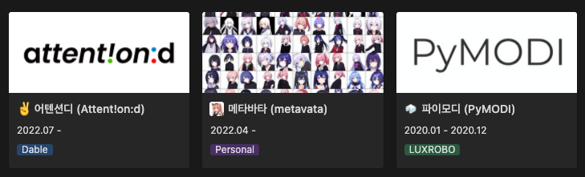

## About Me

---

Type `import jinsung` in the python console below to further discover about me.

<iframe frameborder="0" width="115%" height="360px" src="brython/index.html"></iframe>

## Interest

---

> Machine Learning (Deep Learning), Computer Vision, Robotics, Opensource, Python

## Work Experience

---

**[Dable](https://dable.io/en)** | South Korea (Jul 2022 - Present)  
_Machine Learning Engineer (전문연구요원 전직)_

- Involved in both SW 1.0 and 2.0 of the vision team.
- Lightweighted edge device containing ads player and inference module.
- Implemented custom dag scheduler for daily ads module.
- Preprocessed edge logs to provide realtime RFA calculation.
- Implemented footfall module based on tracking module, used in coex hall.

**[LUXROBO](https://global.luxrobo.com/eng)** | South Korea (Jan 2020 - Jul 2022)  
_Machine Learning Engineer (전문연구요원 편입)_

- Implemented Python API for MODI, [PyMODI](https://github.com/luxrobo/pymodi) for MODI AI KIT.
- Enhaned usability of MODI with SWE such as MODI Firmware Updater, uPyESP32 Firmware and VirtualMODI.
- Led AI Team to win 2nd place in AI Championship 2022.
- Conducted research on depth completion, published the result to CVPR 2022.
- Structured data pipeline using Github Actions with AWS, as well as machine learning apis.
- Received the best peer (of AI) prize in 2021, nominated by many colleagues.

**[Schlumberger UK](https://www.slb.com/about/rd/technology/abtc.aspx)** | United Kingdom (Mar 2018 - Sep 2018)  
_Machine Learning Engineering Intern_

- Implemented a machine learning program which predicts an optimal node group for small-sized reservoir simulation in HPC environment.

**[NEOWIZ](https://www.neowiz.com/neowiz?t=1)** | South Korea (Aug 2017 - Sep 2017)  
_Machine Learning Engineering Intern_

- Implemented a deep musical note generator for a rhythm game called Tapsonic.

## Research Experience

---

**GuideFormer: Transformers for Image Guided Depth Completion**  
Kyeongha Rho\*, [Jinsung Ha](https://94929.github.io)\*, Youngjung Kim  
_IEEE/CVF Conference on Computer Vision and Pattern Recognition (CVPR) 2022_  
[[pdf](https://openaccess.thecvf.com/content/CVPR2022/papers/Rho_GuideFormer_Transformers_for_Image_Guided_Depth_Completion_CVPR_2022_paper.pdf)]

- We propose a fully transformer-based architecture for depth completion.

**User-Guided Colorization Using Optimization and Learned Similarity**  
[Jinsung Ha](https://94929.github.io)\*, [Shuyu Lin](https://shuyulin.co.uk)\*, [Ronald Clark](https://www.ronnieclark.co.uk)

- We propose an optimization based deep learning approach for user-guided colorization.

## Education

---

**[Imperial College London](https://www.imperial.ac.uk/computing)** | London, United Kingdom (Oct 2014 - Oct 2019)  
_[MEng Computing](https://www.imperial.ac.uk/study/courses/undergraduate/computing-meng/) (Artificial Intelligence)_, Achieved 2:1  
_학석사통합과정 전산학 (인공지능)_, GPA 3.3/4.0

- Year 1. Programming, Databases, Architecture, Hardware, Discrete Maths, Maths Methods, Logic, Reasoning about Programs
- Year 2. Artificial Intelligence, Algorithms, Operating Systems, Networks, Software Designs, Statistics, Concurrency, Compilers, Models of Computation, Computational Techniques
- Year 3. Machine Learning, Computer Vision, Robotics, Web Security, Distributed Algorithms, Graphics, Advanced Databases
- Year 4. Deep Learning, Reinforcement Learning, Natural Language Processing, ML for imaging, Maths for ML, Machine Arguing, Distributed Ledgers, Software Engineering for Industry

## Thesis

---

**Fast Deep Depth Image Completion**  
Co-Supervised by [Dr Ronald Clark](https://www.ronnieclark.co.uk) and [Dr Sajad Saeedi](https://www.sajad-saeedi.ca) at [Dyson Robotics Lab](https://www.imperial.ac.uk/dyson-robotics-lab)  
_Achieved First Class Honours (Distinction)_

- The objective is to use deep learning to enhance the depth data thus it can be used to its full benefit in robotic perception tasks.

## Projects

---

## Awards

---

**창업진흥원장상 (2nd Place in [LG Science Park Section](https://youtu.be/kNiEJx1Sl7M))** | [AI Championship 2020](http://kstartup-aic.com)  
_[LUXROBO AI Team](https://youtu.be/WvvKBmTsPTY?t=5822)_

- Developed a deep ensemble network to detect anomaly in noise inspection of electronics.

## Activities

---

**[Google Machine Learning Bootcamp 2020](https://developers-kr.googleblog.com/2020/09/mlbootcamp_11.html)** | [Google Developers](https://developers-kr.googleblog.com/)  
_Participant_

- Deepened my understanding of machine learning and gained practical skills in deep learning frameworks.

**[Opensource Contributon 2021](https://www.oss.kr/contribution_academy)** | [Open Source Software](https://www.oss.kr/)  
_Participant_

- Made a different types of contributions to [pytorch-tutorials-kr](https://tutorials.pytorch.kr/)

## Certifications

---

| Name                             | Issued by  | Expires on |
| -------------------------------- | ---------- | ---------- |
| Deep Learning Specialization     | Coursera   | Never      |
| Tensorflow Developer Certificate | Tensorflow | Jan 2024   |

## Opensource Contributions

---

| Project                                                                              | Role        | PR #       |
| ------------------------------------------------------------------------------------ | ----------- | ---------- |
| [pymodi](https://github.com/LUXROBO/pymodi)                                          | Maintainer  | \>= 97     |
| [iamport-rest-client-python](https://github.com/iamport/iamport-rest-client-python)  | Maintainer  | \>= 43     |
| [pyupbit](https://github.com/sharebook-kr/pyupbit)                                   | Contributor | 5, 7, 8, 9 |
| [pytorch-tutorials-kr](https://github.com/9bow/PyTorch-tutorials-kr)                 | Contributor | 276        |
| [backend-interview-question](https://github.com/ksundong/backend-interview-question) | Contributor | 24         |
| [virtual-modi](https://github.com/LUXROBO/virtual-modi)                              | Author      | \>= 1      |

## Skills

---

### Programming

Python, Typescript, Java, Go, C, Bash

### Language

English, Korean
